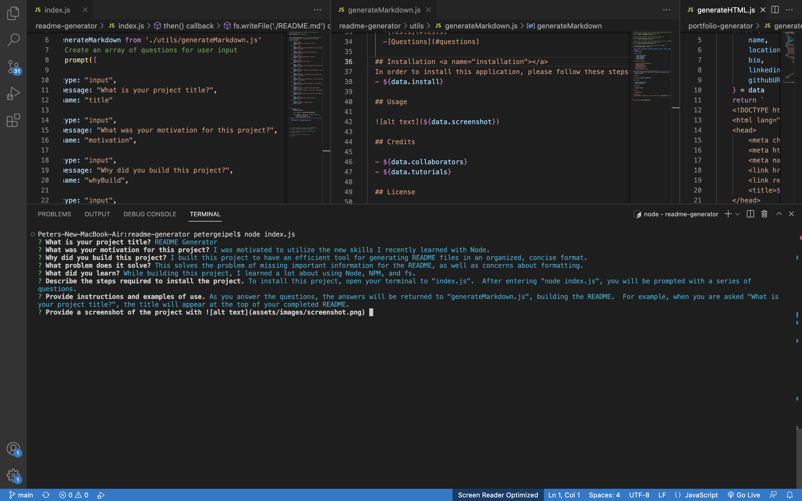

  # README Generator

  ## Description

  - My motivation for this project was to use the tools I recently learned in a practical application.
  - I built this project to have an efficient way of generating README files without worrying about format or missing steps.
  - This solves the problem of ever forgetting important information vital to a good README.
  

  ## Table of Contents

  * [Installation](#installation)
  * [Usage](#usage)
  * [Credits](#credits)
  * [License](#license)
  * [Tests](#tests)
  * [Questions](#questions)

  ## Installation
  In order to install this application, please follow these steps:
  - To install the project, clone the repo.

  ## Usage

  

  ## Credits

  - 
  - 

  ## License

  - N/A

  ## Tests

  - 

  ## Questions
  If you have any questions, please contact me at pwgeipel@att.net.  You may also see more of my projects at [pwgeipel](https://github.com/pwgeipel/).
  

  [Link to repo](https://pwgeipel.github.io/readme-generator/)

  [Link to demo video](https://drive.google.com/file/d/1TG6ElrJz2AGSXN3UAwNNky3IYprtgQwm/view)